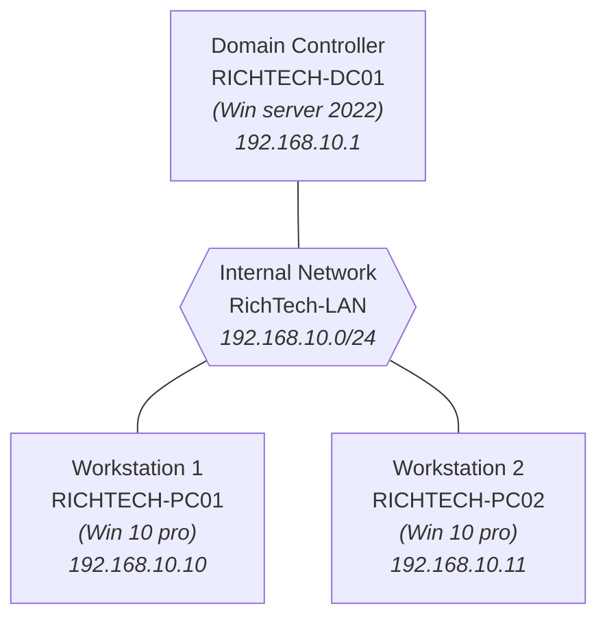

### About

This project is a hands-on IT support lab designed to simulate a small real-world enterprise environment using Windows Server 2022 and Windows 10 virtual machines.

The environment consists of:

- One Windows Server 2022 domain controller
- Two Windows 10 client workstations
- An internal company network
- Active Directory Domain Services (AD DS)
- Organisational Units (OUs), Sales, Finance, IT departments
- Users and groups
- Shared folders and permissions

This lab is beginner-friendly but introduces many concepts commonly used in real IT environments, including:

- Active Directory
- DNS
- Static IP configuration
- Domain joining
- Folder sharing
- User and group management
- Basic enterprise networking

For realism, I used the fictional company name RICHTECH, though you can replace it with your own company name if following along.

### Content

- [Lab Overview](#lab-overview)
- [Requirements](#requirements)
- [Setting Up Server](#setting-up-server)
- [Adding OUs, Users and Groups](#adding-ous-users-and-groups)
- [More on OUs, Users and Groups](#more-on-ous-users-and-groups)
- [Setting Up Client Computers](#setting-up-client-computers)
- [Configuring Group Policy Objects](#configuring-group-policy-objects)
- [Support Examples](#support-examples)
- [Resources](#resources)

### Lab Overview



### Requirements

- Download and install virtualbox - [see here](https://www.virtualbox.org/wiki/Downloads)
- Download window server ISO - [see here](https://www.microsoft.com/en-us/evalcenter/download-windows-server-2022).
  > Note: Windows Server evaluation editions are free to use for 180 days, making them perfect for lab environments.
- Download 64-bit windows 10 ISO - [see here](https://www.microsoft.com/en-us/software-download/windows10ISO)

> Optional:
> You can create a dedicated labs directory. This makes it easier to manage virtual machine files and installation media as the lab grows.

```
/
└── labs
    ├── ISOs
    ├── VMs
```

**VM Requirements**

- At least 2GB RAM
- At least 2 Cores
  > Note: You can install guest additions to improve performance after installation. [Check it out!](https://www.virtualbox.org/manual/topics/guestadditions.html)

### Setting Up Server [[>>]](setting-up-server.md)

> Note: If you are here, it is assumed the you have virtualbox installed and all ISO files downloaded.

This section covers configuring and installing the Windows Server 2022 virtual machine.

Topics include:

- Configuring VM settings before installation
- Installing Windows Server 2022
- Renaming the server
- Setting a static IP address
- Installing Active Directory Domain Services
- Promoting the server to a domain controller

### Adding OUs, Users and Groups [[>>]](adding-ous.md)

This section focuses on organising and managing resources inside Active Directory.

Topics include:

- Creating Organisational Units (OUs)
- Creating users
- Creating security groups
- Understanding enterprise-style organization
- Creating shared folders
- Configuring network share permissions
- Configuring NTFS permissions

### More on OUs, Users and Groups [[>>]](more-on-ous/README.md)

This section main covers using the command line interface for administration in active directory.

### Setting Up Client Computers [[>>]](setting-up-clients.md)

This section covers configuring the Windows 10 client workstations.

Topics include:

- Configuring VM settings before installation
- Installing Windows 10 Pro
- Renaming client computers
- Configuring static IP addresses
- Joining computers to the domain

### Configuring Group Policy Objects [[>>]](gpo.md)

Topics include:

- Setting lockout policy

### Support Examples [[>>]](support-examples/README.md)

This section contains curated IT support scenarios and troubleshooting examples based on the lab environment.

### Resources

- https://www.youtube.com/watch?v=Q4I2lKHboDw
- https://www.youtube.com/watch?v=85-bp7XxWDQ
- https://activedirectorypro.com/install-rsat-remote-server-administration-tools-windows-10/
- https://learn.microsoft.com/en-us/powershell/module/activedirectory/?view=windowsserver2025-ps
