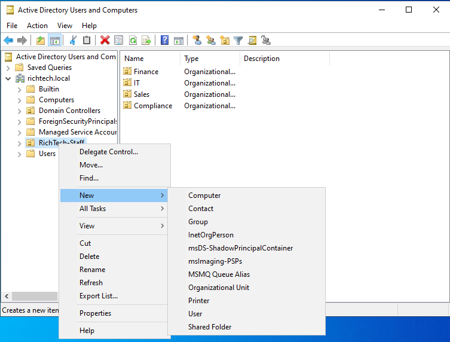
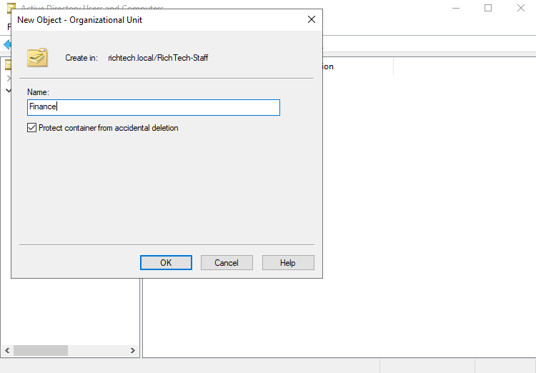
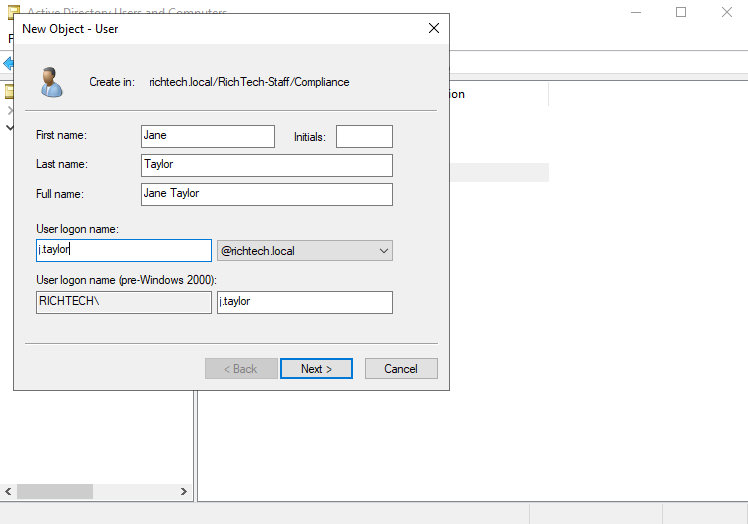
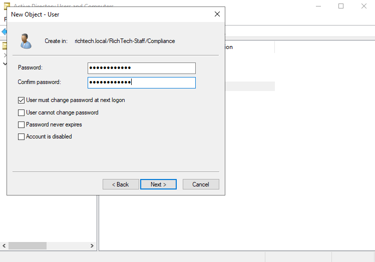
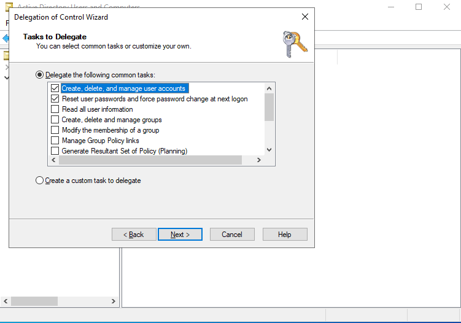
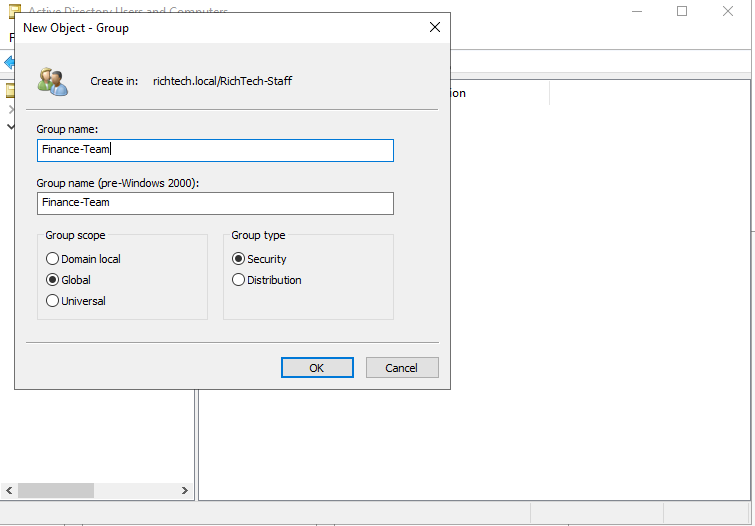
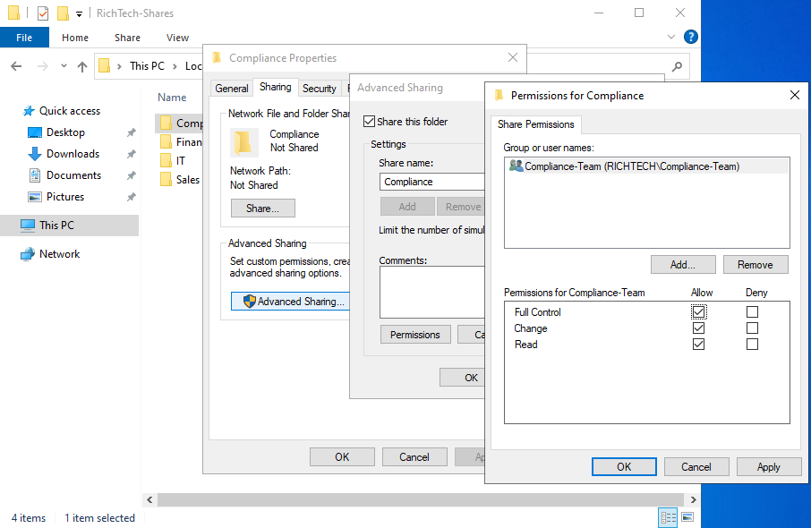
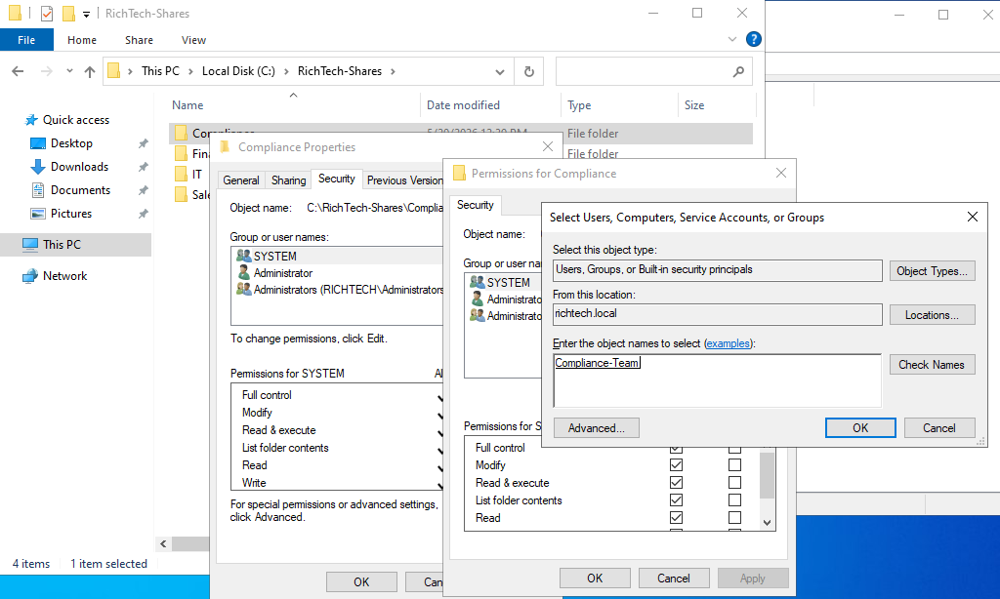
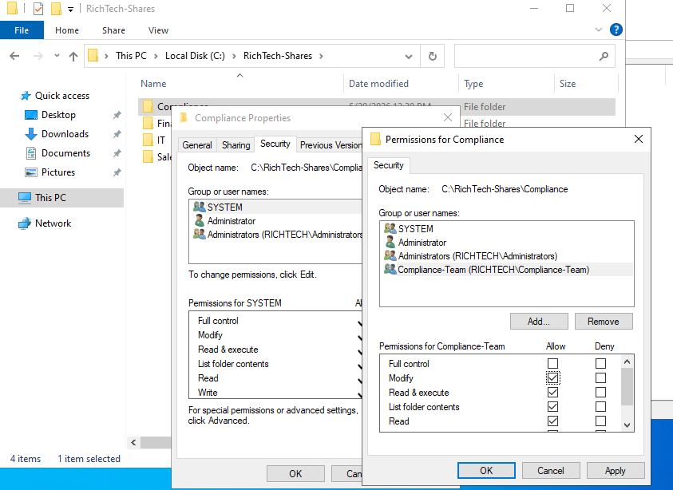

### Sections

- [Creating Organisational Units (OUs)](#creating-organisational-units-ous)
- [Creating users](#creating-users)
- [Creating security groups](#creating-security-groups)
- [Creating shared folders](#creating-shared-folders)
- [Configuring network share permissions](#configuring-network-share-permissions)
- [Configuring NTFS permissions](#configuring-ntfs-permissions)

### Creating Organisational Units (OUs)

Our fictional company will have three departments: `Sales`, `Finance`, and `IT`.

- In Server Manager, click `Tools` in the top-right corner, then select `Active Directory Users and Computers`.
- Under your server’s domain, you will see the default `Users` and `Computers` containers. We will create our own organisational units (OUs).
- Right-click the domain, then select `New > Organisational Unit`.
- Name the OU `CompanyName-Staff`, for example `RichTech-Staff`.
- Inside `RichTech-Staff`, create the department OUs: `Sales`, `Finance`, and `IT`.

To create each department OU, right-click `RichTech-Staff`, then select `New > Organisational Unit` and enter the department name.

### Creating users

- Right-click the OU where you want to create the user.
- Select `New > User`.
- Fill in the user details.

Follow the username convention: `first initial`.`surname`.

For example, if the user is John Doe, the username would be `j.doe`.

- Click `Next`.
- Set a password and select `User must change password at next logon`.
- Complete the wizard to create the user.

Create at least two users for each OU.

**Creating Users with Elevated Rights in AD**

- Assume one of our users, John Doe (j.doe), works on the IT helpdesk. In an enterprise environment, John Doe will have two accounts: one for daily login (standard user) and another for performing administrative tasks, such as creating new users.

- First, create a new OU and name it Administrators.

- Under the Administrators OU, create a new user with the username `adm-j.doe`. The `adm` prefix indicates that this is an administrative account.

- Create a global security group named 'Helpdesk-Team' and add the `adm-j.doe` account to this group.

- Now, delegate object‑specific rights in Active Directory to the Helpdesk-Team group:
  - Right‑click the target OU (for example, the Sales OU) and select Delegate Control.

  - In the Delegation of Control Wizard, click Next.

  - On the Users or Groups page, click Add to add the Helpdesk-Team group, then click Next.

  - On the Tasks to Delegate page, select Delegate the following common tasks, then check `Create, delete, and manage user accounts` and `Reset user passwords and force password change at next logon`.

  

  > Note: These two options are typically all that a helpdesk user requires. Note that many other tasks are available, and these can be selected based on the specific administrative group (for example, a network admin team would need different delegated rights)

- Click Next, review the summary page, and click Finish.

> For more information on how these two accounts are used in practice, see this section [[>>]](more-on-ous/adding-AD-to-workstation.md)

### Creating security groups

In real environments, permissions are rarely assigned directly to individual users. Instead, permissions are assigned to groups, and users are added to those groups.
To create a security group, right-click the `Sales` OU and select `New > Group`.
Configure the following settings:

- Group name: `Sales-Team`
- Group scope: `Global`
- Group type: `Security`
  Click `OK`, then repeat the process for the `Finance` and `IT` OUs.

**Adding Users to Groups**

- To add users to a group, double-click `Sales-Team` inside the `Sales` OU, then open the `Members` tab and click `Add`.
- In the search box, type the name of a sales user, click `Check Names`, then click `OK`. Repeat for the remaining users.

To verify group membership, double-click a user account and open the `Member Of` tab. The assigned group should appear in the list.

### Creating shared folders

- Create the department folders on the server inside `C:\`, for example, `C:\Sales`, `C:\Finance`, `C:\IT`
- To share a folder, right-click the `Sales` folder and select `Properties`. Open the `Sharing` tab, then click `Advanced Sharing`. Enable `Share this folder`, then set the Share name and Comments as appropriate.
- _[Optional]_ To create a hidden share, add a `$` to the end of the share name.
  > Note: A hidden share does not appear when browsing to `\\server`. Users must enter the full UNC (Universal Naming Convention) path directly, for example `\\server\HiddenFolder$`.

### Configuring network share permissions

- In the same `Advanced Sharing` dialog box, click `Permissions`.
- In the Permissions dialog box, remove the `Everyone` group if it exists. Add the appropriate group that should have access to the share, then enable `Full Control` for that group.
- Click `OK` twice, then click `Close` to exit the dialog boxes.
  > Note: Permissions are assigned to groups instead of individual users. This approach is known as Role-Based Access Control (RBAC) and is easier to manage, especially in environments with many users.

### Configuring NTFS permissions

- Right-click the folder and select `Properties`, then open the `Security` tab.
  > If group does not appear, click on edit and then add the group.
- Under `Group or user names`, select the appropriate group and enable the `Modify` permission.
- Do not enable `Full Control`, as this would allow users to change permissions and take ownership of files and folders.
- Click `OK` to apply the changes.

Now the server is complete.
