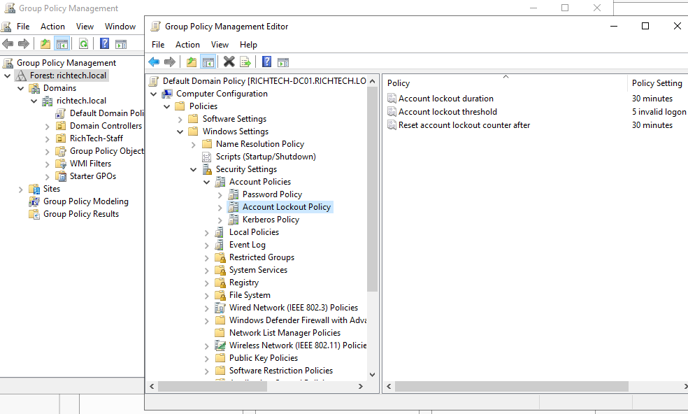

### Sections

- [Setting Lockout Policy](#setting-lockout-policy)

### Setting Lockout Policy

- In the server manager, click on tools then choose 'Group Policy Management' from the drop down.
- Click on the arrow next to Forrest > Domains > then your domain (i.e. richtech.local)
- Right click on 'Default Domain Policy' and choose 'edit'
- Under computer configuration click the following:

  Policies > Windows Settings > Security Settings > Account Policies > Account Lockout Policy

  > Notice there is also a password policy under account policies.

- You will see the following three options,

  `Account lockout threshold` - How many tries until lockout. Default is 5

  `Account lockout duration` - How long until account unlocks itself after exceeding threshold. Default is 30 minutes

  `Reset account lockout counter after` - How long counter resets to 0 after some failed attempts. Default is 30 minutes

- Double click on each and check 'define this policy setting' add time or threshold respectively and click OK.

> Note: This policy will not take effect until the next automatic refresh cycle.

**To Force Policy to Take Effect Immediately,**

- Open command line as administrator.
- Type command `gpupdate /force` then press Enter.
- Once it is done, check lockout work using a clients workstation. [See ticket 2](support-examples/ticket-2.md)

Next --> [adding remote server admistration tool(RSAT) to workstations [>>]](/more-on-ous/adding-AD-to-workstation.md)
