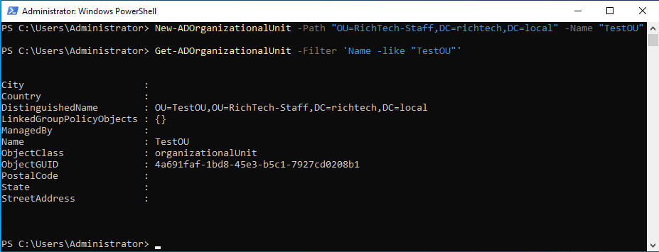
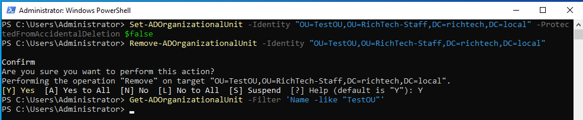

### Sections

- [Overview](#overview)
- [Creating and Removing Organisational Units (OUs) in AD](#creating-and-removing-organisational-units-ous)
- [Managing users in AD](#managing-users)
- [Managing security groups in AD](#managing-users-in-ad)
- [Creating shared folders](#creating-shared-folders)
- [Configuring network share permissions](#configuring-network-share-permissions)
- [Configuring NTFS permissions](#configuring-ntfs-permissions)

### Overview

PowerShell uses the Active Directory (AD) module to manage AD objects. In summary, the main cmdlet verbs used here are New, Get, Set, Add, and Remove. These follow the syntax `Get-AD<object>`. For example, Get-ADOrganizationalUnit, Get-ADUser, Get-ADForest, and so on.

> Note: The 'New' verb is used with the `-Path` parameter, while 'Get', 'Set', and 'Remove' use the `-Identity` parameter to locate the target OU.

[Read more here](https://learn.microsoft.com/en-us/powershell/module/activedirectory/?view=windowsserver2025-ps)

### Creating And Removing Organisational Units (OUs) in AD

Log into RICHTECH-DC01 and open PowerShell. By default, it should open as administrator. If not, right click and select 'Run as Administrator'.

**Creating OU**

- To create a single OU, use the following command.

  ```ps1
  New-ADOrganizationalUnit -Path "OU=RichTech-Staff,DC=richtech,DC=local" -Name "TestOU"
  ```

  - New-ADOrganizationalUnit: cmdlet used to create the OU.
  - Path: specifies where the OU should be created. Note that the AD distinguished name path is written from bottom to top (the opposite of a typical file system path)
    eg:

    ```
    /
    └── RichTech-Staff
      ├── Finance
      ├── IT
      ├── ...
    ```

    If you wanted to create a file or folder inside IT, you would use a path like RichTech-Staff/IT (top to bottom).

    In Active Directory, however, you write the path from the most specific (child) OU to the most general (parent) OU, then the domain components. For example:

    `OU=IT,OU=RichTech-Staff,DC=richtech,DC=local`

    This is equivalent to thinking IT inside RichTech-Staff (child before parent ie. bottom to top)

  - Name: specifies the name of the new OU.

- Verify that OU has has been created using

  ```ps1
  Get-ADOrganizationalUnit -Filter 'Name -like "TestOU"'
  ```

  You should see the details of the OU displayed.

  

**Deleting OU**

- Before deleting an OU, you must first disable accidental deletion protection, as this setting is enabled ($true) by default.
- Use the following command to set accidental deletion protection to $false

  ```ps1
  Set-ADOrganizationalUnit -Identity "OU=TestOU,OU=RichTech-Staff,DC=richtech,DC=local" -ProtectedFromAccidentalDeletion $false
  ```

- Then use the `Remove-ADOrganizationalUnit` cmdlet to delete the OU

  ```ps1
  Remove-ADOrganizationalUnit -Identity "OU=TestOU,OU=RichTech-Staff,DC=richtech,DC=local"
  ```

  Input `Y` to confirm deletion when prompted.

- Verify that the OU has been removed by running

  ```ps1
  Get-ADOrganizationalUnit -Filter 'Name -like "TestOU"'
  ```

  No output should be returned because the OU no longer exists.

  

### Managing Users in AD

### Managing Security Groups in AD

### Creating Shared Folders

### Configuring Network Share Permissions

### Configuring NTFS permissions
