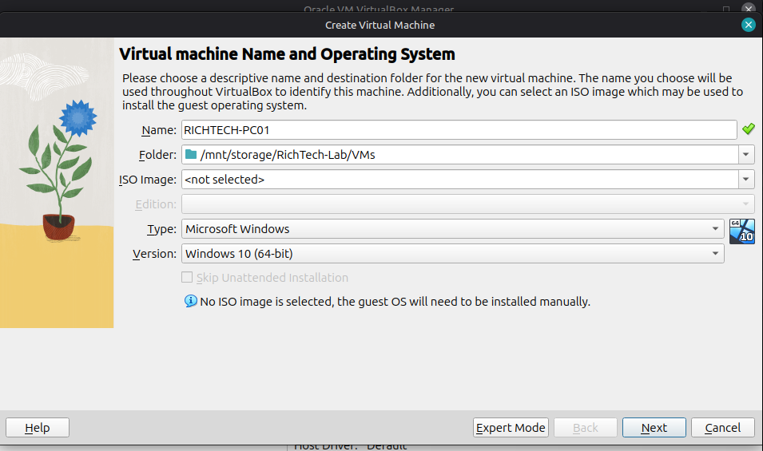
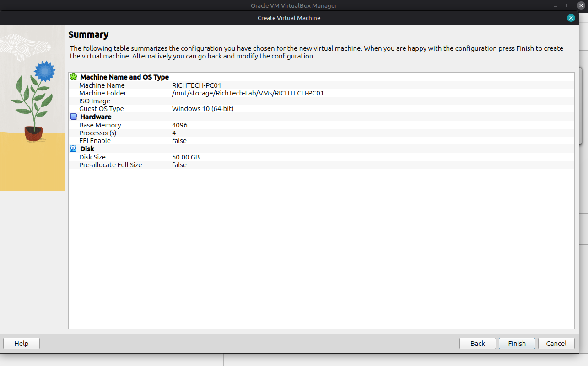
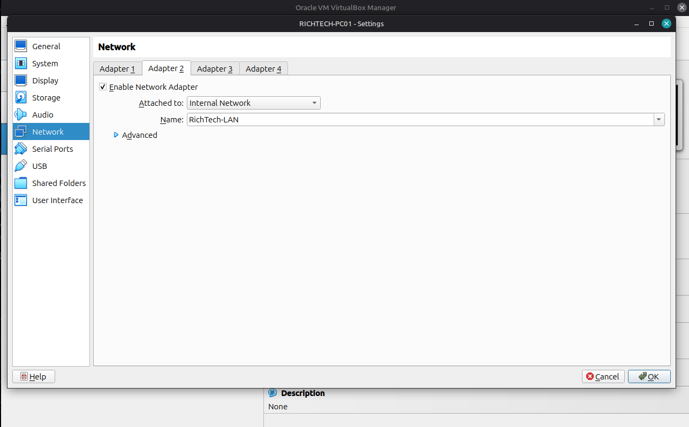
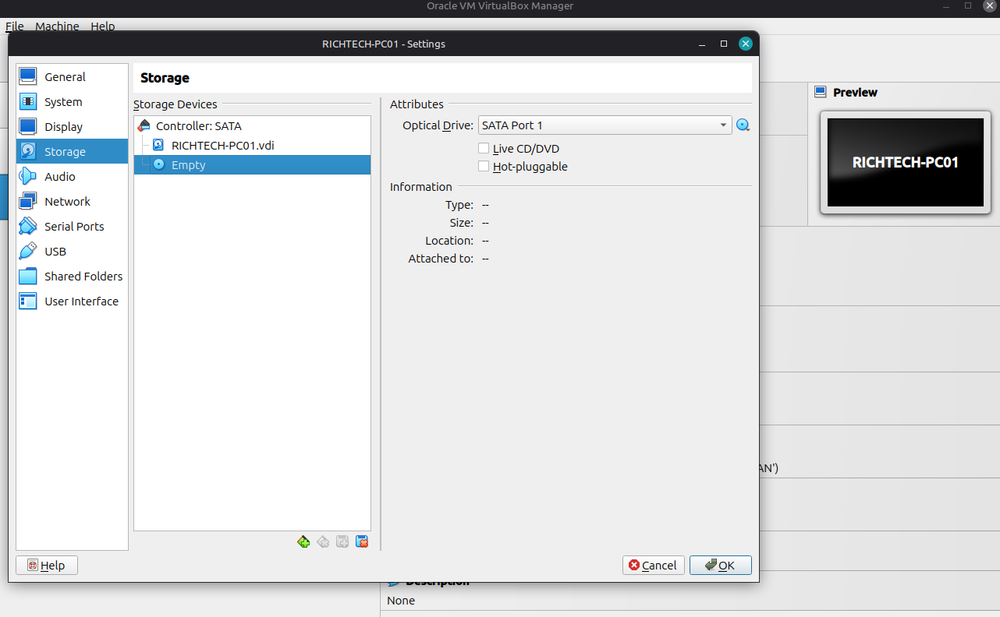
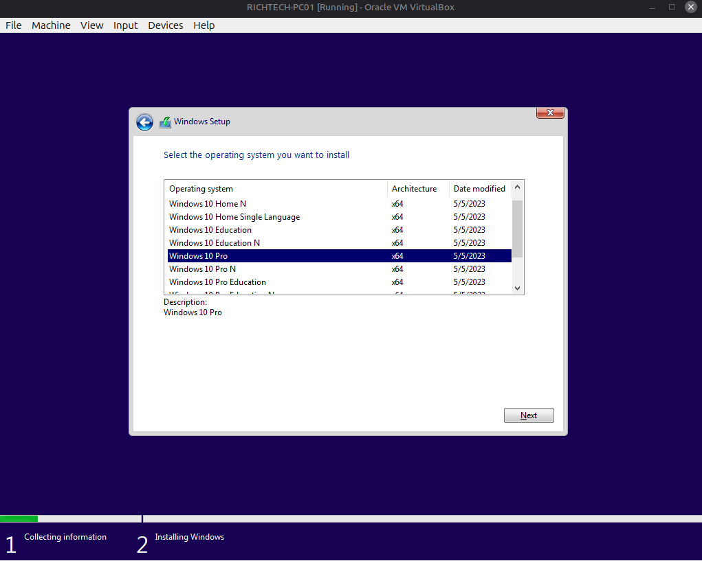
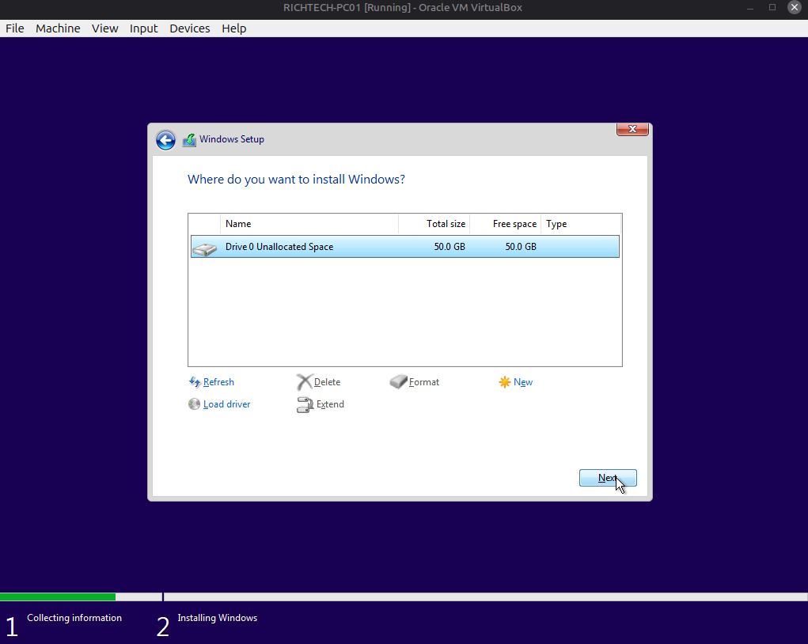
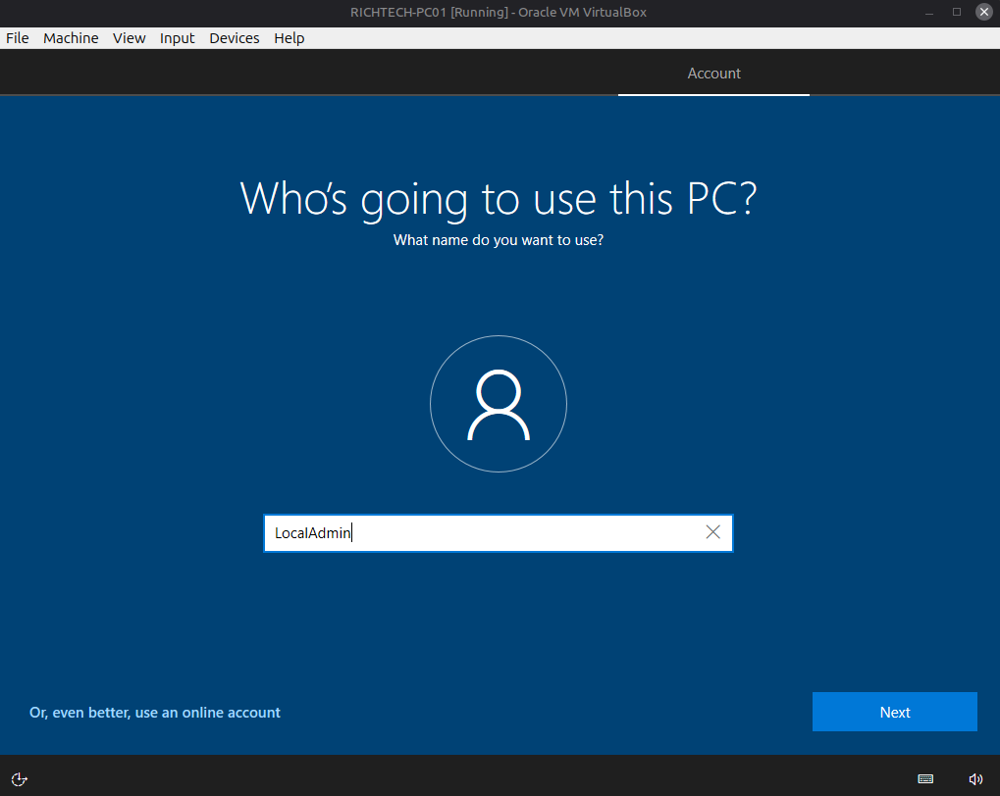
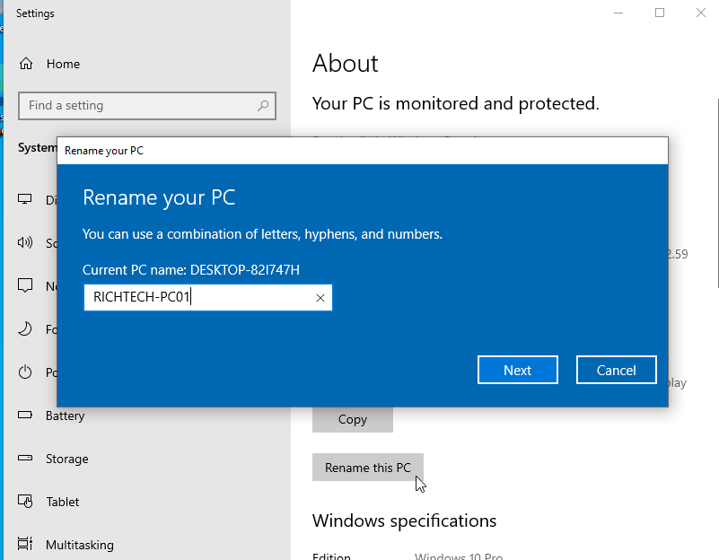
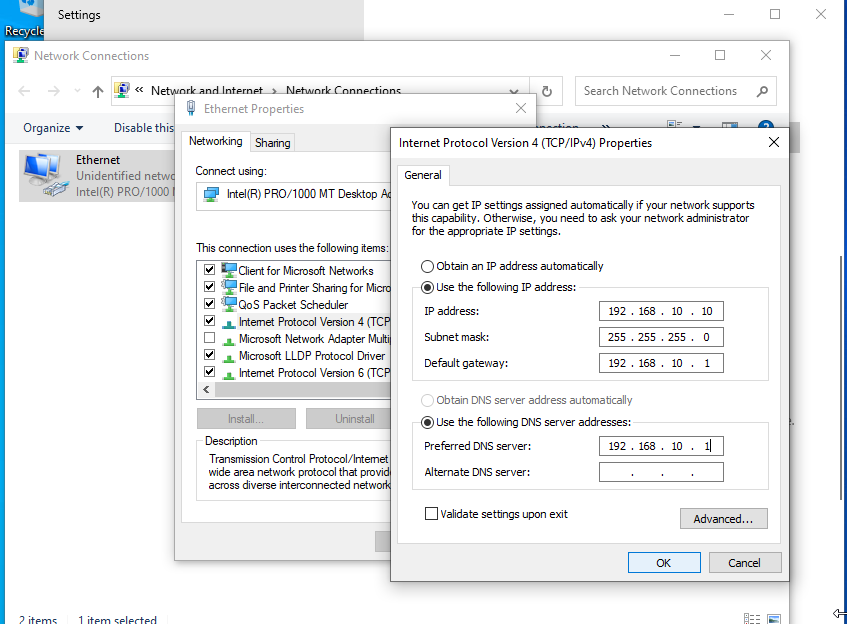
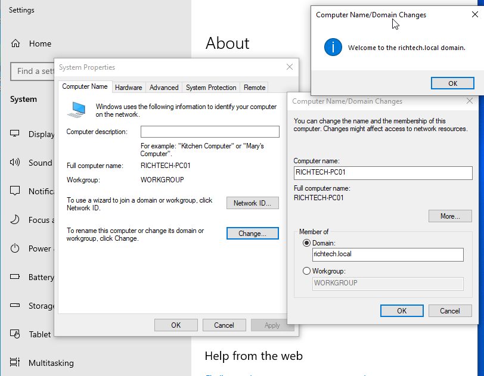

### Sections

- [Configuring VM settings before installation](#configuring-vm-settings-before-installation)
- [Installing Windows 10 Pro](#installing-windows-10-pro)
- [Renaming client computer](#renaming-client-computers)
- [Configuring static IP addresses](#configuring-static-ip-addresses)
- [Setting DNS correctly](#setting-dns-correctly)
- [Joining computers to the domain](#joining-computers-to-the-domain)

### Configuring VM settings before installation

**Adding the Virtual Machine (VM)**

- Click `New` and enter the VM name, VM path, OS type, and OS version. Do not attach the ISO yet.
- Set the RAM and CPU cores based on your VM requirements and what your host machine can comfortably handle. I used `4 GB RAM` and `4 CPU cores`.
- Set the virtual disk size (I left the default `50 GB`), then click `Next` and `Finish` to create the VM.

**Configuring Network Adapter**

- Select the new VM and open `Settings > Network`.
- On `Adapter 1`, keep the adapter attached to `NAT`. This will be the internet-facing adapter used during setup.
- On `Adapter 2`, enable the network adapter, attach it to an `Internal Network`, and use the same internal network name as the one for the server(`RichTech-LAN`).
- Click `OK` to save the settings.

**Mounting ISO file**

- Open `Settings > Storage`.
- Under `Controller: IDE/SATA`, select the empty disc icon. On the right side, click the small disc icon next to `Optical Drive`, then select `Choose a disk file`.
- Browse to your ISO location (mine was `/mnt/storage/RichTech-Lab/ISOs/`) and select the `Windows Server 2022` ISO.

### Installing Windows 10 Pro

- Start the VM. Most of the installation process is straightforward. The main steps that matter are selecting the correct edition, partitioning the disk, and creating a local account.
- For the edition, choose Windows 10 Pro, as it includes the features required for an enterprise environment.

- For disk partitioning, you will see a single unallocated disk using the size you selected earlier. Select it and click Next.

- After Windows finishes installing and the VM restarts, complete the initial setup (choose setup for organisation). When prompted to sign in, choose `join domain instead`. This allows you to create a local account instead of using a Microsoft account.
- Use LocalAdmin as the username and choose a password. Continue through the remaining setup steps to complete the installation.

### Renaming client computers

After successfully setting up Windows, the next step is to rename the computer.

- Right-click the Start button and select System. Click Rename this PC and enter the new computer name. In this example, the computer name is RICHTECH-PC01.
- You will be prompted to restart the computer. You can restart immediately or choose to do it later after configuring the IP address settings.

### Configuring static IP addresses

- Right-click the network icon in the taskbar and select Open Network & Internet Settings. Under advanced network settings, click `change adapter options`.
- You will see two network adapters: one for NAT and one for the Internal Network.
- To identify each adapter, right-click it and select Status > Details. The NAT adapter will have an IP address starting with 10.0.2.x.
- Once you identify the Internal Network adapter, right-click it and select Properties. Select Internet Protocol Version 4 (TCP/IPv4) and click Properties.
- Configure the following settings:
  - IP Address: 192.168.10.10
    Start workstation IP addresses at .10 to keep the addressing scheme clean and easier to remember.
  - Subnet Mask: 255.255.255.0
    This corresponds to a /24 CIDR subnet.
  - Default Gateway: 192.168.10.1
    Traffic to external networks is routed through the company server, so the server IP is used as the default gateway.
  - Preferred DNS Server: 192.168.10.1
    DNS queries will be handled by the server.
- Click OK to save the settings, then restart the computer

### Joining computers to the domain

- Right-click the Start button and select System. Under related settings, click `Rename this PC (Advanced)`.
- In the System Properties window, click Change. Under Member of, select Domain and enter your domain name. In this example, the domain is richtech.local.
- Click OK. You will be prompted to enter domain administrator credentials. After authentication, Windows will confirm that the computer has joined the domain.
- You will then be prompted to restart the computer. Restart it to apply the changes.
- After the restart, the login screen will display an Other user option. Select it, and you should see the company or domain name displayed below the password field.

